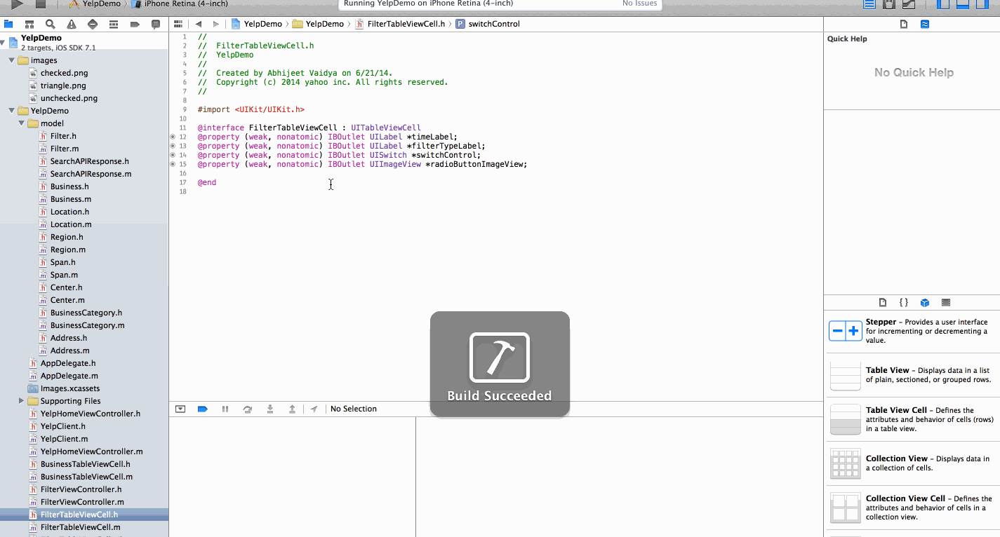

Yelp Demo
==================

This is an IOS demo application for displaying the businesses / restaurants using the [Yelp API](http://www.yelp.com/developers/documentation/v2/search_api).

Time spent: 13 hours spent in total

Completed user stories:

 * [x] Required: Search results page - Custom cells should have the proper Auto Layout constraints
 * [x] Required: Search results page - Search bar should be in the navigation bar 
 * [x] Required: Filters page - categories, sort (best match, distance, highest rated), radius (meters), deals (on/off)
 * [x] Required: Filters page - The filters table should be organized into sections as in the mock
 * [x] Required: Filters page - Radius filter & Sort By filter should expand as in the real Yelp app
 * [x] Required: Filters page - Categories should show a subset of the full list with a "See All" row to expand.
 * [x] Required: Filters page - Clicking on the "Search" button should dismiss the filters page and trigger the search w/ the new filter settings.
 * [x] Required: Filters page - Clicking on cancel should go back to Search Results page without any Filters in place

Walkthrough of all user stories:

Acknowledgements:

 Licecap - GIF created with [LiceCap](http://www.cockos.com/licecap/).
 
 AFNetworking - Copyright (c) 2013-2014 AFNetworking (http://afnetworking.com/)
 
 BDBOAuth1Manager - Copyright (c) 2013 Bradley David Bergeron (https://github.com/bdbergeron/BDBOAuth1Manager)

 Icons - Used from The Noun Project (http://thenounproject.com/)
 

